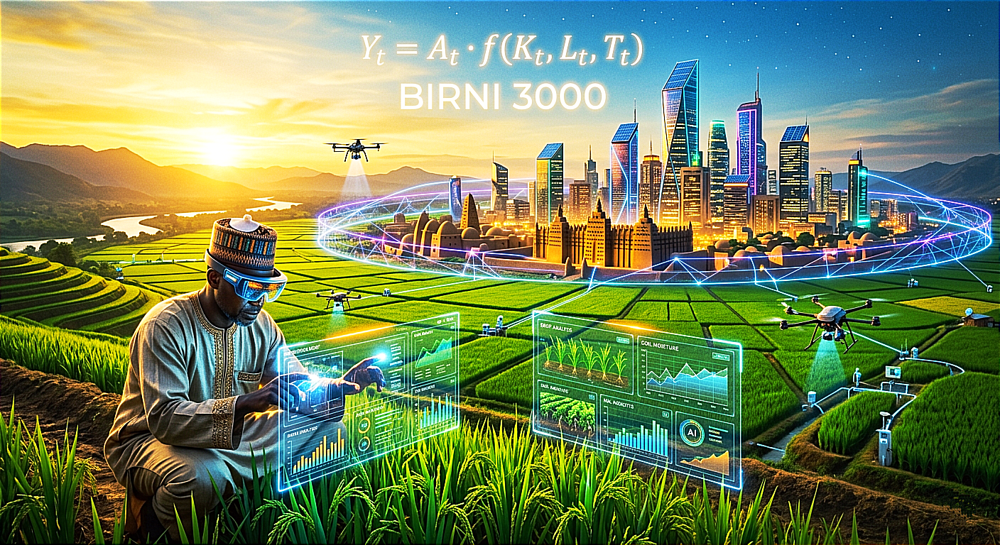

# 🌍 Birni 3000: African Visionary Legends

  

> **"Building the Bridge of Time: Integrating Agri-Business with AI, Web3, and Cybersecurity."**

---

## 🚀 Overview / Takaitaccen Bayani
**Birni 3000** babban shiri ne na **Khamzas KGC Services** wanda ke da nufin sauya fasalin aikin gona a Afirka. Muna hada hikimar manomanmu na gargajiya da fasahar zamani don tabbatar da wadatar abinci da habaka tattalin arziki.

---

## 📈 The Economic Growth Formula (Lissafin Tattalin Arziki)
Wannan ita ce dabara da muke amfani da ita don auna nasarar ayyukanmu:

$$Y_t = A_t \cdot f(K_t, L_t, T_t)$$

| Variable | English Description | Bayani a Hausa |
| :--- | :--- | :--- |
| **$Y_t$** | **Output:** Total agricultural production. | **Amfanin gona** da darajar tattalin arziki. |
| **$A_t$** | **AI Factor:** Efficiency through AI innovation. | **Tasirin AI** da ƙirƙire-ƙirƙire. |
| **$K_t$** | **Capital:** Smart machinery and investment. | **Jari** da kayan aikin zamani. |
| **$L_t$** | **Labor:** Human expertise and capacity. | **Ƙwadago** da basirar manoma. |
| **$T_t$** | **Technology:** Web3 and Cybersecurity. | **Web3 da Cybersecurity** don tsaro. |

---

## 🛠 Tech Stack (Fasahar Da Muke Amfani Da Ita)
* **AI & Robotics:** Noman zamani (Precision farming) da kula da gona da Drones.
* **Web3:** Amfani da Blockchain don bin diddigin kayan gona.
* **Cybersecurity:** Kare bayanan manoma da na'urorin gona daga masu kutse.

---

## 🔗 Connect With Us / Hanyoyin Sadarwa

| Platform | Link |
| :--- | :--- |
| **Discord** | [Join our Community](https://discord.gg/S4KhHsrr2) |
| **X (Twitter)** | [Follow @ibrahiminnah](https://x.com/ibrahiminnah) |
| **Linkidin** |  https://www.linkedin.com/in/ibrahim-yakubu-5059343b6?utm_source=share_via&utm_content=profile&utm_medium=member_android |
| **OpenSea** | [Explore NFT Collection](https://opensea.io/african_visionary_legends) |
| **Email** | [ibrahiminnah@gmail.com](mailto:ibrahiminnah@gmail.com) |

---

  © 2026 African Visionary Legends | Built with ❤️, Code, and Vision.

